# Bandwidth Delay Product Patterns

Visualising stuff is great. You can see _patterns_ and wonder whole day what do they actually mean.

After reading [Google's "BBR: Congestion-Based Congestion Control"][bbr_paper] paper I plotted instantaneous bandwidth vs round trip time and came with those plots:

[bbr_paper]:https://research.google.com/pubs/pub45646.html

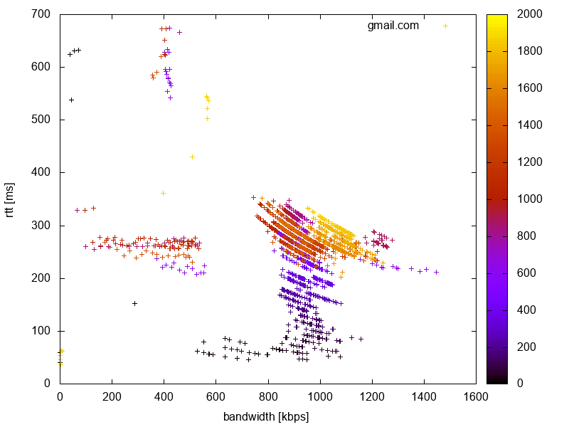

[**Bandwidth-delay product**][bdp_wiki] (BDP) is a "product of data link capacity and round trip time". The plot above depicts instantaneous bandwidth (BW) and round trip time (RTT) for acknowledged packets, for 5MB [random content][rand_wiki] content uploaded to Gmail.
Horizontal axis is BW, vertical axis is RTT. The colors are time scale. Black points are the earliest ones, yellow the latest ones.

[bdp_wiki]:https://en.wikipedia.org/wiki/Bandwidth-delay_product
[rand_wiki]:https://en.wikipedia.org/wiki//dev/random

# Patterns

There are several patterns emerging in the plot:

* BDP lines (the curves), which in [log-log plot](images/upload_gmail_5m_1.log.png) are straight. It means that
  bandwidth-delay product is constant in some time period. Smells like [Little's Law][littles_law].

* Discrete BDP curves (parallel lines in log-log plot). This means that BDP, as a property of the system, changes
  discreetly. I don't know what property of the connection changes though, it doesn't seem to be TCP window size.

* The patterns are reproducible for the same service, and to some extent are similar between the services. See [Gallery](#gallery) for more examples.

* Different and repeatable "constellations" of points: main set of dots in the middle, flat constellation on the left and also one on
  the top.

[littles_law]:https://en.wikipedia.org/wiki/Little%27s_law

# Gallery

The upper row shows BW and RTT in linear scale, the lower row shows part of the data in log-log
scale (mind the straight lines!). Each shot was taken three times in a row (pun intended).

Uploading 5MB of random content to [gmail.com](https://gmail.com):

[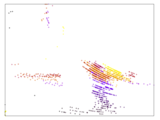](images/upload_gmail_5m_1.png)
[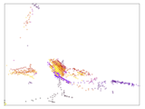](images/upload_gmail_5m_2.png)
[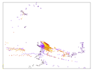](images/upload_gmail_5m_3.png)

[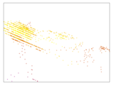](images/upload_gmail_5m_2.log.png)
[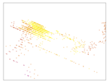](images/upload_gmail_5m_3.log.png)

Uploading 5MB of random content to [files.fm](https://files.fm/):

[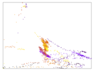](images/files.fm_1.png)
[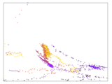](images/files.fm_2.png)
[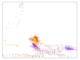](images/files.fm_3.png)

[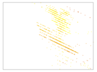](images/files.fm_1.log.png)
[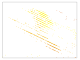](images/files.fm_2.log.png)
[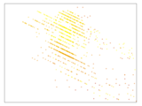](images/files.fm_3.log.png)

Uploading 5MB of random content to [uploadfiles.io](https://uploadfiles.io):

[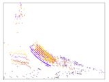](images/uploadfiles.io_1.png)
[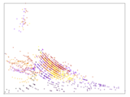](images/uploadfiles.io_2.png)
[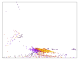](images/uploadfiles.io_3.png)

[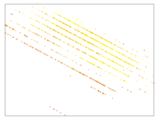](images/uploadfiles.io_1.log.png)
[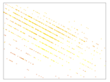](images/uploadfiles.io_2.log.png)
[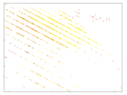](images/uploadfiles.io_3.log.png)

Running a connection speed test at [speedtest.net](https://speedtest.net):

[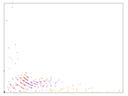](images/speedtest.net_1.png)
[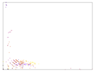](images/speedtest.net_2.png)
[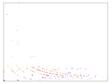](images/speedtest.net_3.png)

[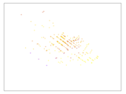](images/speedtest.net_1.log.png)
[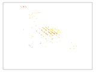](images/speedtest.net_2.log.png)
[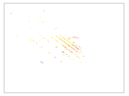](images/speedtest.net_3.log.png)

# How to use the tool

`bdp` tool extracts bandwidth (BW) and round trip time (RTT) from pcap dumps. `bdp-plot` is a wrapper around
[gnuplot][hb_gnuplot] to plot the output from `bdp` tool.
It works well with with upload traffic, it is not possible to measure precisely BW and RTT for download.
Methodology to measure BW and RTT was taken from the [previously mentioned paper][bbr_paper].

[hb_gnuplot]:http://brewformulas.org/Gnuplot

Install:

    go install
    (cd bdp-plot; go install)
    # This is needed for bdp-plot
    brew install gnuplot

Dump traffic with:

    tcpdump -ieth0 -w dump.pcap -s200 -v

Use "stats mode" to get the IP addresses of the upload:

    bdp -i dump.pcap -s
    192.168.xxx.xxx    216.58.xxx.xxx     3972
    216.58.xxx.xxx     192.168.xxx.xxx    2198
    192.168.xxx.xxx    10.15.xxx.xxx      38
    192.168.xxx.xxx    192.168.xxx.xxx    30

Now extract the data:

    bdp -i dump.pcap -l 192.168.xxx.xxx -r 216.58.xxx.xxx > dump.csv

And plot it:

    bdp-plot -i dump.csv -o dump.png

